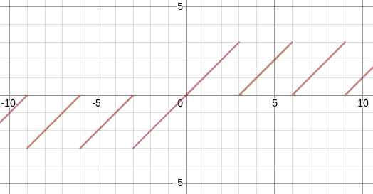
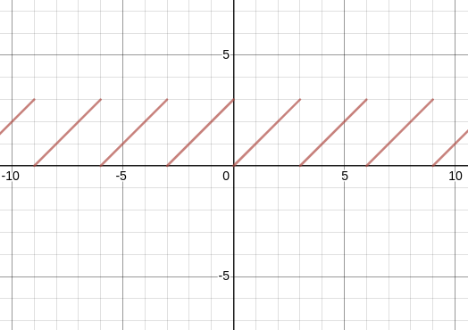
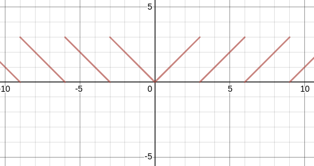

## MOD

### C++自带



### Positive



```cpp
int mod_pos(int a,int b) { return a >= 0 ? a % b : a % b + b; }
```

### Symmetric



```cpp
int mod_sym(int a, int b) { return abs(a) % b; }
```

### Double(positive)
```cpp
double mod_db(double a, double b) { return a - floor(a / b) * b; }
```